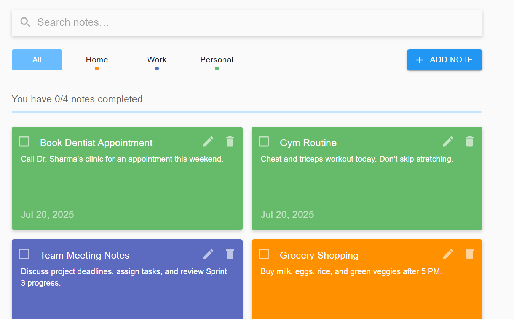
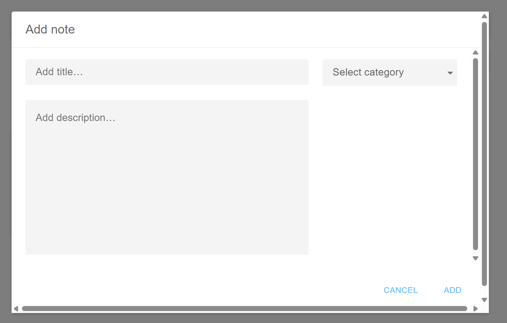
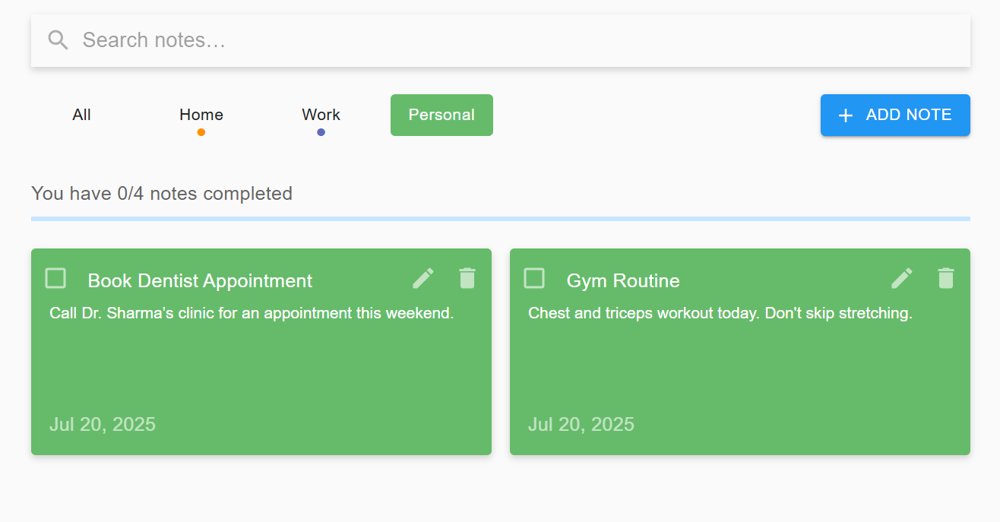

# Notes App

A simple, modern, and responsive notes application built with React, Redux, and Material-UI. Easily add, edit, delete, and categorize your notes with a beautiful UI.

## Features

- Add, edit, and delete notes
- Mark notes as completed
- Filter notes by category
- Search notes
- Responsive design
- Material-UI components and theming

## Screenshots

## Home Page


##  Adding a New Note


## Filter by Category


## Getting Started

### Prerequisites
- Node.js (v12 or higher recommended)
- npm

### Installation

1. Clone the repository:
   ```bash
   git clone https://github.com/samarrajawat/notes-app.git
   cd React-Notes-App
   ```
2. Install dependencies:
   ```bash
   npm install
   ```
3. Start the development server:
   ```bash
   npm start
   ```
   The app will be available at `http://localhost:3000`.

### Build for Production

```bash
npm run build
```

### Deploy to GitHub Pages

```bash
npm run deploy
```

## Project Structure

```
React-Notes-App/
├── public/                # Static assets
├── src/
│   ├── components/        # React components
│   ├── images/            # SVGs and images
│   ├── redux/             # Redux store, reducers, middleware
│   ├── styles/            # JSS style files
│   ├── util/              # Utility functions
│   ├── App.js             # Main app component
│   └── ...
├── package.json
└── README.md
```

## Technologies Used
- React 17
- Redux & React-Redux
- Material-UI v4
- JavaScript (ES6+)

## Scripts
- `npm start` – Start development server
- `npm run build` – Build for production
- `npm test` – Run tests
- `npm run deploy` – Deploy to GitHub Pages

## License

This project is licensed under the MIT License.
